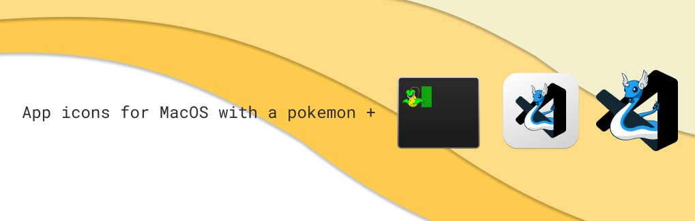

# ⛰️ POKICONE - VSCode Pokemon Icon

Beautiful icons for MacOS users and Pokemon lovers.

## 🎨 Download Icons

- [ VSCode Light ](https://github.com/Hessabra/PokIcone/blob/master/VscodeBack/dragonair-vscode-white.icns)
- [ VSCode No Background ](https://github.com/Hessabra/PokIcone/blob/master/VscodeNoBack/dragonair-vscode.icns)
- [ Iterm No Background ](https://github.com/Hessabra/PokIcone/blob/master/ItermNoBack/Victreebel-Iterm.icns)

## 💡 Usage (only for macOS)

1. Select VSCode app in your `Applications` folder.
2. Right click and select `Get Info`.
3. Drag & drop the new icon over the VSCode app icon.
4. Enjoy 🎉!